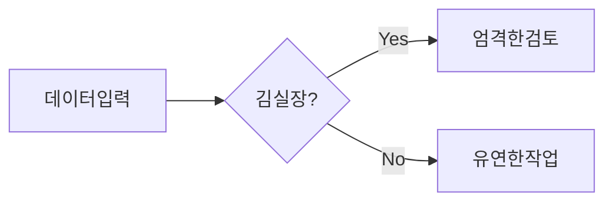
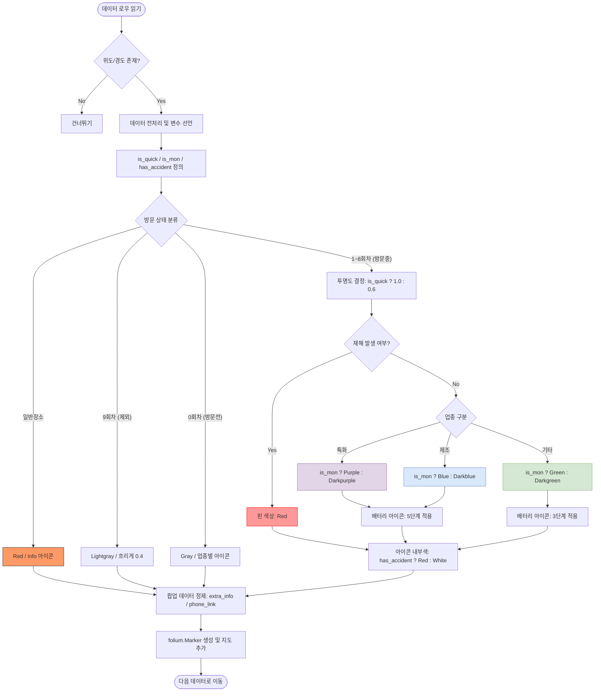

# 나의 첫 순서도

# 📍 사업장 마커 생성 및 스타일 결정 로직 순서도

본 문서는 엑셀 데이터를 기반으로 지도의 마커(색상, 투명도, 아이콘)를 결정하는 핵심 알고리즘을 정의합니다.

## 1. 개요
- **목적**: 방문 회차 및 업체 특성에 따른 시각적 차별화
- **핵심 변수**: 
    - `v_count`: 방문회차 (0~9)
    - `quick_pass`: 퀵패스 여부 (문자열)
    - `monitoring`: 모니터링 여부 (문자열)
    - `d_count`: 재해발생건수 (정수)

---

## 2. 시각화 로직 순서도

---

## 3. 주요 방어적 코드 (Defensive Code)
나중에 코드를 수정할 때 참고해야 할 핵심 구문입니다.

1. **문자열 포함 확인 (`in`)**: 엑셀 입력 오류 방지
   - `is_mon = '모니터링' in monitoring.strip()`
2. **팝업 쉼표 정제**: 정보가 없을 때 깔끔하게 표시
   - `extra_info = f"{q_display}, {m_display_text}".strip(", ")`
3. **클릭 방지 링크**: 정보가 없을 때 오작동 방지
   - `phone_link = f"tel:{phone}" if phone != '정보없음' else "javascript:void(0);"`